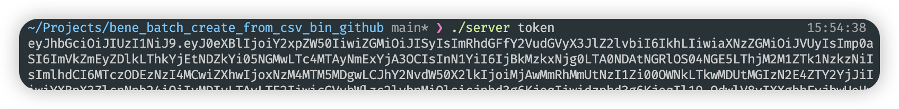
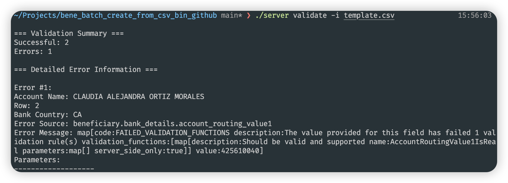
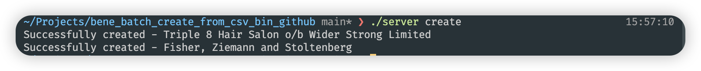

# Binary Runnable for Batch Creating Beneficiaries
## Run as User
If you're not familiar with Golang or would not like to touch any code, follow this steps:
1. Get binary from this repo - `server` for Unix-like OS, `server.exe` for Windows
2. Update `CLIENT_ID` and `API_KEY` in `.env` (if you'd like to provide token directly, skip this)
3. Run in terminal `./server token` - It'll override `AIRWALLEX_TOKEN` in `.env` by requesting `/api/v1/authentication/login`. You can also manually override `AIRWALLEX_TOKEN` and skip all previous steps.

4. Fill out a csv file with beneficiaries information in fields in `template.csv`
5. Run in terminal `./server validate -i <path to the csv>`. You'll get a summary and error details in both console and `validation_errors.csv`, and successful records in JSON format in `validation_results.json` - they're ready for batch create beneficiaries.

6. Run in terminal `./server create` to actually create benes into your account. It iterates JSON records in `validation_results.json` under `successful.results` as request body.

7. (Environment Switching) By default above commands will run to Demo environment. Make sure all JSONs are good to go prod and you can add `-prod` argument in above commands to execute to Prod env. Of course all env variables should be retrieved from Prod WebApp.
## Run as Developer